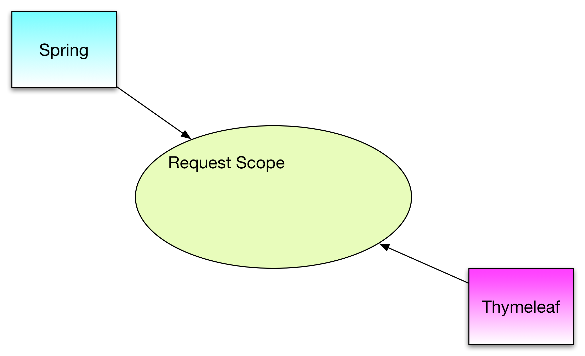
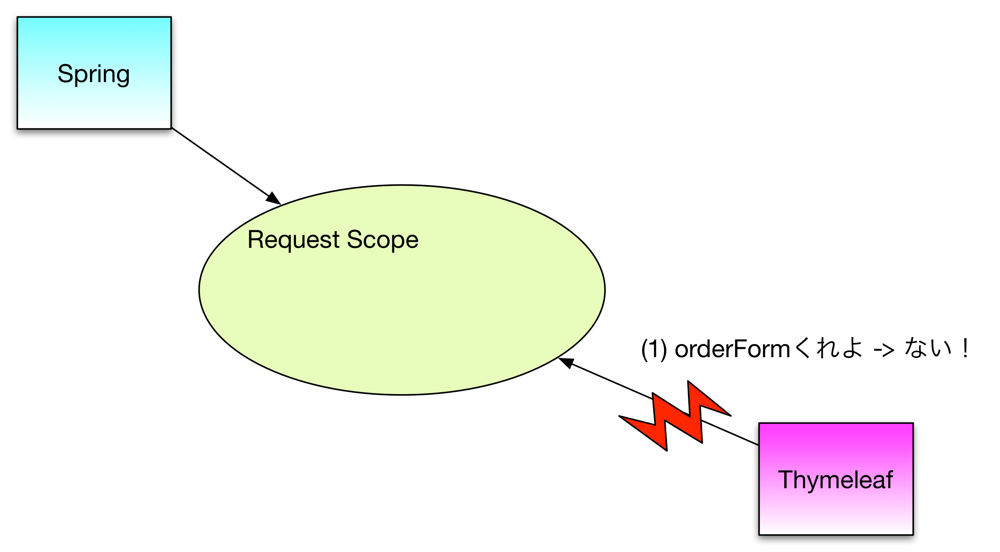

# Appendix.A よくある質問

## コントローラとViewのバインドの仕組み

### 0. 前提
ModelAttribute クラスが以下のように定義されていたとします。

#### モデルアトリビュート(OrderForm)
```java
public class OrderForm {
  // getter, setter は省略
  private String id;
}
```

また、以下のHTTPリクエストに対応する処理を実装中とします。

| Path | Method | 処理 |
| -- | -- | -- |
| /orders/entry | GET | オーダー登録画面の初期表示 |


### 1. バインドなし
まず、バインドなしのケースを考えます。

#### コントローラ
```java
@Controller
@RequestMapping("/orders")
public class OrderEntryController {
	@RequestMapping(path="/entry", method=RequestMethod.GET)
	public String entry() {
		return "order/order-entry";
	}
}
```

#### ビュー（抜粋）
```html
<form method="post">
  <input type="text" name="id" id="id"/>
</form>
```
この場合、コントローラ・ビューともに「モデルアトリビュートのことを知らない」ので、エラーなく実行することができます。

### 2. リクエストスコープ
Spring FrameworkとThymeleafは、ユーザからHTTPリクエストが送られてくると、お互い共有のオブジェクト置き場（特定のメモリ領域）を参照します。
オブジェクト置き場には幾つか種類があるのですが、一番よく利用する（そして、akikuraの大半のケースで利用する）置き場のことを **request scope（リクエストスコープ）**と言います。

Spring Framework で@ModelAttribute アノテーションが付与されたメソッドや引数は、リクエストの都度初期化され、リクエストスコープに保存されます。



### 3. ビューにth:object属性を付与

ビューにth:object属性を付与して、モデルアトリビュートをバインドします。

```html
<form method="post" th:object="${orderForm}">
  <input type="text" th:field="*{id}"/>
</form>
```

この定義によりビューは、「リクエストスコープ上に orderForm という名前でオブジェクトが存在する」前提で動作をします。一方、Springは依然としてモデルアトリビュートの存在を知らないため、初期化をしません。

従って、リクエストスコープ上に誰もorderFormを作成することなく、Thymeleafが参照に行くため、エラーとなります。



### 4. コントローラに@ModelAttribute属性を付与
先ほどさらっと書きましたが、コントローラは利用者のHTTPリクエストを受けて@RequestMappingメソッドを実行する際、事前に以下の処理を実行します。

- @ModelAttributeアノテーションつきのメソッドを実行して、リクエストスコープに戻り値を保存する。
- @ModelAttributeアノテーションつきの引数を初期化（コンストラクタ呼び出し）し、リクエストスコープに保存する。

この特性を利用して、@RequestMapping メソッドを以下のように書き換えれば、リクエスト呼び出し時にorderFormを初期化できます。

```java
@Controller
@RequestMapping("/orders")
public class OrderEntryController {
	@RequestMapping(path="/entry", method=RequestMethod.GET)
	public String entry(@ModelAttribute OrderForm form) {
		return "order/order-entry";
	}
}
```

さらに、Spring Frameworkの仕様で、@RequestMapping メソッドの引数では @ModelAttribute アノテーションを省略できる機能があるため、以下のようにも記載できます。

```java
@Controller
@RequestMapping("/orders")
public class OrderEntryController {
	@RequestMapping(path="/entry", method=RequestMethod.GET)
	public String entry(OrderForm form) {
		return "order/order-entry";
	}
}
```

皆さんが参考にしている荷主登録画面は、この方式で実装しているはずです。

#### /orders/entryアクセス時の処理
利用者が /orders/entry にアクセスした時の処理は以下の通りです。

1. 利用者がブラウザで/orders/entryにアクセスする
2. DispatcherServletがHTTPリクエストを受け取る
  3. 担当するコントローラを検索 -> OrderEntryController#entry() に決定
  4. OrderEntryController に@ModelAttributeメソッドがあれば実行し、リクエストスコープに保存 -> 今回は無いのでスキップ
  5. entry() メソッドに@ModelAttribute つき引数があればコンストラクタ実行し、リクエストスコープに保存 -> orderForm誕生
6. entry() メソッド実行
  7. Thymeleafに所定のビュー（order-entry.html）を処理依頼
8. Thymeleaf は order-entry.htmlを処理して、HTML文字列を生成する。この際、リクエストスコープからorderFormを参照する。


#### 参考
- [Using @ModelAttribute on a method](http://docs.spring.io/spring/docs/current/spring-framework-reference/htmlsingle/#mvc-ann-modelattrib-methods)
- [Using @ModelAttribute on a method argument](http://docs.spring.io/spring/docs/current/spring-framework-reference/htmlsingle/#mvc-ann-modelattrib-method-args)
- [Supported handler method arguments](http://docs.spring.io/spring/docs/current/spring-framework-reference/htmlsingle/#portlet-ann-requestmapping-arguments)