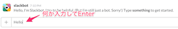

# 1. インターン開始までの準備
この章では、インターンの採用が決まってから学習開始までにあなたが実施する作業について説明します。

## 1-1. メールアドレスの連絡
インターンの採用が決まったら、**あなたが在籍している学校のインターン担当の教員もしくは事務員の方に、あなたのメールアドレスを連絡してください**。

すでにお持ちのアドレスでも、新たに取得したものでもなんでも構いません。また、メールの種類も、インターネットプロバイダが提供するもの、GMailなどのWEBメール等、種類は問いません。

連絡したメールアドレスは、携帯電話等でいつでも見れる状態にしておいてください。

## 1-2. 弊社からメールに返信します
あなたが連絡したメールアドレスは、弊社インターン担当者に通知されます。

その後、弊社よりあなたのメールアドレス宛にメールを送信します。送信メールのドメインは **"nakamura-joho.co.jp"**です。

#####（メール例）
```
title: ナカムラ情報）インターン確認メール

message: 
---------------------------------------
（当メールに心当たりがない方は無視してください）

株式会社ナカムラ情報 ×× と申します。
はじめまして。

このメールは、弊社インターン開始にあたっての確認メールです。
お手数ですが、このメールアドレス宛に返信をお願いします。

【返信の際、以下の情報を必ず記載してください！】
- あなたのフルネーム
- 名前の読み仮名
- 在籍する学校名

以上、よろしくお願いいたします。

---------------------------------------
```

メールを受け取ったら、その**メールに返信をお願いします**。
返信メールの本文には、以下の情報を必ず記載してください。

- あなたのフルネーム
- あなたのお名前の読み仮名
- 在籍する学校名

この返信メールを弊社担当が受け取れば、インターン受付は完了となります。
弊社担当から、メールを受け取った旨の返信メールを送信します。このメールに対する返信は不要です。

#####（メール例）
```
title: ナカムラ情報）インターン受付完了

message: 
---------------------------------------
○○さん

株式会社ナカムラ情報 ×× と申します。
こんにちは。

弊社インターンの受付を完了しました。
初回来社日はX月X日(土）9:00〜です。
これから３ヶ月間、一緒に頑張りましょう。

【注意事項】
- 会社に着いたらインターフォンを押してください。
- 急用で休み・遅れがある場合は、弊社までお電話にて連絡ください(xxx-xxxx-xxxx)
- 初回来社日までに、お渡しした「akikura開発ガイド」の３章までを完了してください。不明な点があればSlack（ガイド内に説明あり）で質問してください。
※もし３章まで完了しなかった場合は、来社日に直接支援します。

以上、よろしくお願いいたします。

---------------------------------------
```

## 1-3. Slackの招待メールが来ます。

インターン受付完了から間も無くして、[**Slack**](https://slack.com/)というチャットサービスから、あなたのメールアドレス宛に招待メールが届きます。

Slackはグループ作業用のチャットサービスです。インターン中の質問や進捗の報告は、このサービス上で行います。

1. メールが **njdev** というグループへの招待であることを確認してください。
2. **Join njdev** ボタンをクリックしてください。

#####（メール例）


メールの**Join njdev**ボタンをクリックすると、ブラウザ上にSlackのアカウント登録ページが表示されます。ユーザ名（チャット画面上に表示されるので、わかりやすい名前にしてください）とパスワードを入力して、「Next」ボタンをクリックします。


アカウント作成が完了したら、以下のようなWelcomeページが表示されます。「Explore Slack」ボタンをクリックしてください。


すると、**slackbot**という相手からメッセージが届くので、適当に入力して、Enterキーを押します（Enterで相手に送信されます）。



メッセージを送信すると、あなたが閲覧可能なスレッド（**Channel**と言います）をお知らせする吹き出しが出るので、「Got it!」を押してください。以降、使い方等を説明する吹き出しがいろいろ出るかもしれませんが、全てGot it!しておけば良いです。


CHANNELSの中から、**#general**をクリックしてください。


画面右側にチャットのやりとりが表示されるはずです。
このチャンネルで弊社従業員全員とメッセージのやりとりができます。試しに挨拶しても構いませんし、インターン初日までそっとしておいても構いません。

## 1-4. Slackクライアントアプリのインストール
他の人の書き込みを見逃さないように、お持ちの携帯電話にSlackアプリをインストールしましょう。iOS版/Android版があります。お持ちの携帯にSlackアプリがない場合は、定期的にPCのブラウザから閲覧するようにしてください。ブラウザはChromeを使用すると、書き込みがあるたびに通知ポップアップが出るので、オススメです。

## 1-5. この後の作業
以上で、弊社従業員と連絡を取るための設定は完了です。
続いて、**インターン初日までに**以下２つの章で説明する作業を実施してください。

1. 「2.ツールのインストール」では、インターンの作業で使用するツールをノートPCにインストールする手順を説明します。
2. 「3.開発サーバへの接続」では、弊社サーバに接続するための手順を説明します。