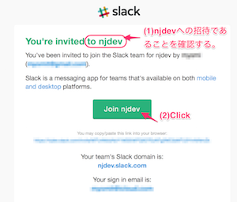
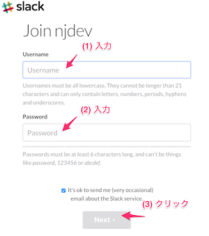
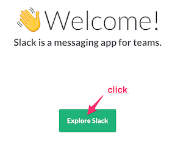
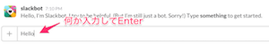

# 1-3. Slackの招待メールが来ます

インターン受付完了から間も無くして、[**Slack**](https://slack.com/)というチャットサービスから、あなたのメールアドレス宛に招待メールが届きます。

Slackはグループ作業用のチャットサービスです。インターン中の質問や進捗の報告は、このサービス上で行います。

1. メールが **njdev** というグループへの招待であることを確認してください。
2. **Join njdev** ボタンをクリックしてください。

#####（メール例）

メールの**Join njdev**ボタンをクリックすると、ブラウザ上にSlackのアカウント登録ページが表示されます。ユーザ名（チャット画面上に表示されるので、わかりやすい名前にしてください）とパスワードを入力して、「Next」ボタンをクリックします。

アカウント作成が完了したら、以下のようなWelcomeページが表示されます。「Explore Slack」ボタンをクリックしてください。

すると、**slackbot**という相手からメッセージが届くので、適当に入力して、Enterキーを押します（Enterで相手に送信されます）。

メッセージを送信すると、あなたが閲覧可能なスレッド（**Channel**と言います）をお知らせする吹き出しが出るので、「Got it!」を押してください。以降、使い方等を説明する吹き出しがいろいろ出るかもしれませんが、全てGot it!しておけば良いです。

CHANNELSの中から、**#general**をクリックしてください。

画面右側にチャットのやりとりが表示されるはずです。
このチャンネルで弊社従業員全員とメッセージのやりとりができます。試しに内容はなんでも良いので、メッセージを書き込んでみてください。

以降、インターンに関する質問は全て、Slackを使って行います。

