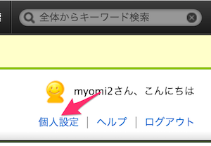

# 1-5. Backlogの招待メールが来ます

インターン受付完了から間も無くして、[**Backlog**](http://www.backlog.jp/)というサービスから、あなたのメールアドレス宛に招待メールが届きます。

Backlogはプロジェクト管理及びソースコード管理のサービスです。インターン中に作成するソースコードの管理は、このサービス上で行います。

1. メールが **NJ開発用** というスペースへの招待であることを確認してください。
2. **スペースURL** リンクををクリックしてください。

#####（メール例）

メールの**スペースURL**リンクをクリックすると、ブラウザにBacklogのログイン画面が表示されます。
メールに記載されたユーザID・パスワードを入力して、ログインしてください。

ログインできたら、「個人設定」-> 「パスワード」より、パスワード変更を行ってください

