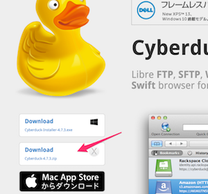

# 2-11. （Macユーザのみ）Cyberduck
弊社のファイルサーバ（書類の保管場所）にアクセスするためのアプリケーションです。

## インストール
[Cyberduckのダウンロードページ](https://cyberduck.io/index.ja.html?l=ja)より、zpiファイルをダウンロードしてください。Mac App Storeの有料版もありますが、フリー版(zip）で構いません。

