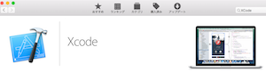

# 2-2. （Macユーザのみ）XCode
XCodeは、MacやiOS端末(iPhone,iPad)用のアプリケーションを開発するための開発環境です。akikura開発で直接使用することはありませんが、ターミナル上でのコマンド作業を行うのに便利なコマンドやツールが含まれていますので、インストールしておきましょう。

## XCodeのインストール

App Store からXCodeをインストールします。



インストールが完了したら、XCodeを起動します。
規約同意のダイアログが表示されたら、同意してください。

規約同意が完了したら、XCodeを終了します。

## /usr/local フォルダの存在確認

ターミナルを起動し、以下のコマンドを実行してください。

```sh
$ ls -al /usr/local
total 104
drwxr-xr-x   21 myomi  admin    714 12  1 19:24 .
drwxr-xr-x@  13 root   wheel    442 10  4 22:36 ..
(以下続く）
```
上記のようにフォルダの内容が表示されればOKです。

フォルダが存在しない場合は以下のようにエラーがでます。

```sh
$ ls -al /usr/local
ls: /usr/local: No such file or directory
```

### /usr/local フォルダがある場合
お持ちのPCのOSがEl Capitan(OS X 10.10)よりも前の場合は、何もする必要がありません。
El Capitanの場合は、以下のコマンドを実行して、今後の作業に必要な権限を付与してください。

```sh
$ sudo chown $(whoami):admin /usr/local 
$ sudo chown -R $(whoami):admin /usr/local
```

## /usr/local フォルダがない場合

El Capitan(OSX 10.11)入りのMacを購入した方の中には、/usr/localフォルダがない場合があります。以下の手順に従って、フォルダを作成します。

- Macをリカバリモード（⌘+R を押しながら起動）で起動し、ターミナルを立ち上げる
- ターミナルで csrutil disable コマンドを実行する
- Macを通常の方法で再起動する。
- ターミナルで以下のコマンドを実行する
```sh
$ sudo mkdir /usr/local 
$ sudo chflags norestricted /usr/local 
$ sudo chown $(whoami):admin /usr/local 
$ sudo chown -R $(whoami):admin /usr/local
```
- もう一度リカバリモード(⌘+R を押しながら起動）で起動し、ターミナルを立ち上げる
- ターミナルで csrutil enable を実行
- Macを通常の方法で再起動する。

[参考サイト：HomebrewはEl Capitanへアップグレードする前に入れておく](http://qiita.com/riocampos/items/525ec4b35744ad586c5a)

これで、/usr/local フォルダができているはずです。
もう一度、以下のコマンドを実行して、存在を確認してください。
```sh
$ ls -al /usr/local
```

## XCode コマンドラインツールのインストール
ターミナルで以下のコマンドを実行します。
```sh
$ sudo xcodebuild -license
$ xcode-select --install
```

これで、コマンドラインツールのインストールは完了です。