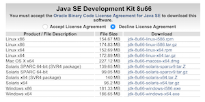

## 2-4. JDK

OracleのJDKダウンロードサイトで、お持ちのPCにインストール可能なJDKをダウンロードします。インターン実施時点の最新バージョンを選んでください。

2015-12-04現在、以下のURLからダウンロードできます。
http://www.oracle.com/technetwork/java/javase/downloads/jdk8-downloads-2133151.html



ダウンロードしたexe(Macはdmg)ファイルを実行してインストールを行います。

インストールが完了したら、コマンドプロンプトで以下のコマンドを実行し、java及びjavacのバージョン番号が、先ほどインストールしたものであることを確認します。

```sh
$ java -version
java version "1.8.0_60"
Java(TM) SE Runtime Environment (build 1.8.0_60-b27)
Java HotSpot(TM) 64-Bit Server VM (build 25.60-b23, mixed mode)
$ javac -version
javac 1.8.0_60
```