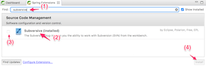

# 2-5. STS
STSはJavaの開発環境です。
akikuraでは、[Spring Framework](http://projects.spring.io/spring-framework/)というJavaのフレームワークを使用して開発を行います。STSは、EclipseをベースにSpringを便利に利用するための様々なツールが同梱されています。

## インストール
[STSのサイト](https://spring.io/tools/sts)から、最新バージョンのインストーラをダウンロードします。

ダウンロードしたらファイルを解凍し、中にあるインストーラを実行してください。

## プラグインの追加
開発に使用するツール（プラグイン）を追加インストールしましょう。

STSを起動します。

画面に表示されている「Dashboard」右下の「IDE EXTENSIONS」をクリックします。

まずは、「Gradle Support」というプラグインをインストールしましょう。
検索バーに「gradle」と入力すると、「Gradle Support」というプラグインが表示されます。チェックをONにして、「Install」ボタンをクリックします。規約同意等の画面が出るので同意し、インストールを実施してください。

インストール終了後、再起動を求められたら再起動を行ってください。

続いて、「Subversive」というプラグインをインストールします。
検索バーに「subversive」と入力すると、プラグインが表示されますので、先ほどと同様にインストールを実行してください。

以上で、STSのインストール作業は完了です。