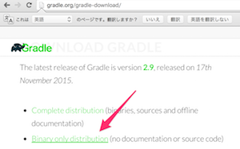

# 2-6. Gradle
Gradleは「ビルドツール」と言われる種類のツールです。開発現場では、ソースコードを製品作成用にコンパイルする際、javacコマンドやEclipseのビルド機能を利用することは滅多になく、たいていの場合ビルドツールを使ってコンパイルや製品化の様々な処理を行います。

## Windowsユーザの場合
[Gradleのダウンロードページ](http://gradle.org/gradle-download/)より、Binaryをダウンロードします。



ダウンロードしたファイルを解凍し、解凍したフォルダをPCの任意の場所に配置します（例 - C:\gradle-2.9）。

インストールしたフォルダ直下にあるbinフォルダのパスを**ユーザ環境変数PATH**に追加してください。上記の例だと、C:\gradle-2.9\bin です。

システム環境変数のPATHを操作し間違えると、他の操作に影響を及ぼすので、必ず**ユーザ**環境変数のPATHに追加するようにしてください。

環境変数の設定方法がわからない場合は、[こちら](http://next.matrix.jp/config-path-win7.html)を参考にしてください。

設定が終わったら、コマンドプロンプトでgradleコマンドが有効に動作することを確認しましょう。

```sh
$ gradle -v

------------------------------------------------------------
Gradle 2.9
------------------------------------------------------------

Build time:   2015-11-17 07:02:17 UTC
Build number: none
Revision:     b463d7980c40d44c4657dc80025275b84a29e31f

Groovy:       2.4.4
Ant:          Apache Ant(TM) version 1.9.3 compiled on December 23 2013
JVM:          1.8.0_60 (Oracle Corporation 25.60-b23)
OS:           Mac OS X 10.11.1 x86_64
```

## Mac ユーザの場合

ターミナルで以下のコマンドを実行します。

```sh
$ brew install gradle
```

続いて、gradleコマンドが動作することを確認します。

```sh
$ gradle -v

------------------------------------------------------------
Gradle 2.9
------------------------------------------------------------

Build time:   2015-11-17 07:02:17 UTC
Build number: none
Revision:     b463d7980c40d44c4657dc80025275b84a29e31f

Groovy:       2.4.4
Ant:          Apache Ant(TM) version 1.9.3 compiled on December 23 2013
JVM:          1.8.0_60 (Oracle Corporation 25.60-b23)
OS:           Mac OS X 10.11.1 x86_64
```
