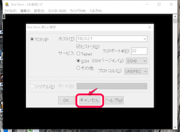
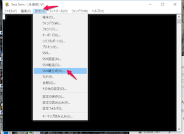
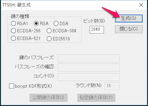
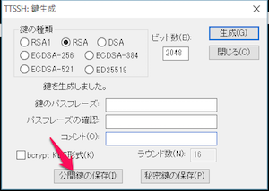
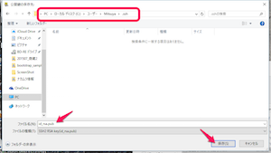
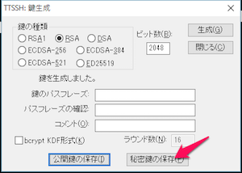
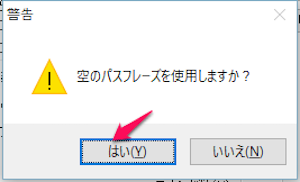
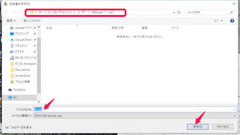
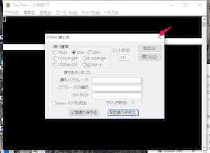

# 3-1. 鍵の作成

弊社サーバへの接続は、「公開鍵認証」という方法で行います。
公開鍵認証を行うためには、お持ちのパソコンで「公開鍵」と「秘密鍵」という２つの鍵ファイルを作成する必要があります。以下の手順に従って鍵ファイルを作成しましょう。


## 注意
これから作成する鍵ファイルは以下の２つです。
- 公開鍵。ファイル名はid_rsa.pub
- 秘密鍵。ファイル名はid_rsa

これらのうち、秘密鍵id_rsaは**絶対に外部に漏洩しないように気をつけてください。**
メールで送付したり、DVD等で第３者に渡してはいけません。
一方、公開鍵id_rsa.pub は公開しても構いません（むしろ、外部に公開することで役に立つファイルです）。


## Windowsユーザの場合

Tera Termを起動します。「Tera Term 新しい接続が」ウィンドウが表示されたら、キャンセルボタンを押してください。



メニューより 設定->SSH鍵生成を選択します。



「TTSSH: 鍵生成」ウィンドウが表示されるので、「生成」ボタンをクリックします。



続いて、「公開鍵の保存」ボタンをクリックします。



保存先を選択するダイアログが表示されるので、以下のように入力して「保存」ボタンをクリックします。
- 保存先のディレクトリ：C:\Users\[ユーザ名]\.ssh ディレクトリ。
    - .sshディレクトリが存在しない場合は作成してください。
    - Windowsの場合、ドットで始まるディレクトリが作成できない場合があるようです。もしうまく作成できない場合は、お好きなディレクトリを指定してください。ただし、以降の説明は全て上記のディレクトリに鍵がある前提で説明しますので適時読み替えてください。
- ファイル名: id_rsa.pub



続いて、「秘密鍵の保存」ボタンをクリックします。



「空のパスフレーズを使用しますか？」と聞かれたら、「はい」をクリックしてください。



保存先を選択するダイアログが表示されるので、以下のように入力して「保存」ボタンをクリックします。
- 保存先のディレクトリ：公開鍵の保存場所と同じ
- ファイル名: id_rsa



閉じるボタンをクリックします。



Tera Termを終了します。以上で公開鍵・秘密鍵の作成は完了です。

## Macユーザの場合
コンソールで以下のコマンドを入力します。
```sh
$ ssh-keygen
Generating public/private rsa key pair.
Enter passphrase (empty for no passphrase): [何も入力せずにEnter]
Enter same passphrase again: [何も入力せずにEnter]
```

これで、/Users/[ユーザ名]/.ssh フォルダに id_rsaファイル(秘密鍵)とid_rsa.pub（公開鍵）が生成されているはずです。

以下のコマンドでid_rsa というファイル（秘密鍵）とid_rsa.pubというファイル（公開鍵）が作成されていれば成功です。

```sh
$ ls -al /Users/[ユーザ名]/.ssh
total 40
drwx------   8 myomi  staff   272 11 24 19:14 .
drwxr-xr-x+ 70 myomi  staff  2380  1  5 18:56 ..
-rw-------   1 myomi  staff  1679 11  8 14:16 id_rsa
-rw-r--r--   1 myomi  staff   419 11  8 14:16 id_rsa.pub
```


