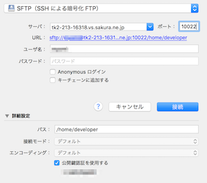

# 3-3. ファイルサーバに接続する
ファイルサーバには、インターン中に使用するドキュメントが保存されています。
作成した公開鍵・秘密鍵を使って、ファイルサーバにアクセスしてみましょう。

## Windows ユーザの場合

### WinSCP用鍵の作成（最初の１回だけ）
Windowsユーザは、WinSCPを使用してファイルサーバに接続します。
WinSCPで公開鍵・秘密鍵を利用するには、専用の鍵ファイルを作成する必要があります。初回の接続時だけ、以下の作業を行ってください。

WinSCPをインストールしたフォルダの下にある、Puttyフォルダを開きます。

※通常は、C:\Program Files(x86)\WinSCP\PuTTY もしくはC:\Program Files\WinSCP\PuTTY

フォルダ内にあるputtygen.exe をダブルクリックで起動します。

Load ボタンをクリックします

## Macユーザの場合
Cyberduckを起動します。

新規接続をクリックします。

以下のように入力して「接続」ボタンをクリックします。

| 項目 | 設定値 |
| -- | -- |
| 接続の種類 | SFTP(SSHによる暗号化FTP) |
| サーバ | tk2-213-16318.vs.sakura.ne.jp |
| ポート | 10022 |
| ユーザ名 | メールで連絡されたユーザID |
| パスワード | 空欄のまま |
| Anonymousログイン | チェックしない |
| キーチェーンに追加する | チェックしない |
| パス | /home/developer |
| 公開鍵認証を使用する | チェックを入れ、作成した秘密鍵ファイル(id_rsa)のパスを指定する |

以下のように「商蔵」フォルダが表示されれば、サーバへの接続成功です。今見えてるフォルダは、ファイルサーバに置いてあるフォルダです。

毎回接続設定しなくても済むように、ブックマークに登録しておきましょう。アクションボタン->新規ブックマークをクリックします

以下のように入力します。
入力したら、閉じるボタンをクリックします。

| 項目 | 設定値 |
| -- | -- |
| ニックネーム | ナカムラ情報ファイルサーバ |
| ダウンロード先のパス | サーバ上にあるファイルを、ローカルPCにダウンロードする際のダウンロード先です。デフォルトではMac標準のダウンロードフォルダになっていますが、インターン用にフォルダを作り、そこを指定しておくと良いでしょう |

以降は、ブックマークをダブルクリックするだけで、ファイルサーバにアクセスできるようになります。

