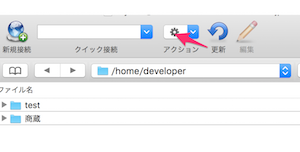

# 3-3. ファイルサーバに接続する
ファイルサーバには、インターン中に使用するドキュメントが保存されています。
作成した公開鍵・秘密鍵を使って、ファイルサーバにアクセスしてみましょう。

## Windows ユーザの場合

### WinSCP用鍵の作成（最初の１回だけ）
Windowsユーザは、WinSCPを使用してファイルサーバに接続します。
WinSCPで公開鍵・秘密鍵を利用するには、専用の鍵ファイルを作成する必要があります。初回の接続時だけ、以下の作業を行ってください。

WinSCPをインストールしたフォルダの下にある、Puttyフォルダを開きます。

※通常は、C:\Program Files(x86)\WinSCP\PuTTY もしくはC:\Program Files\WinSCP\PuTTY

フォルダ内にあるputtygen.exe をダブルクリックで起動します。

Load ボタンをクリックします

「3-1.鍵の作成」で作成した秘密鍵（id_rsa)を選択し、開くをクリックします

鍵のロードに成功した旨を知らせるダイアログが表示されるので、OKボタンをクリックします。

WinSCP用秘密鍵を作ります。Save private keyボタンをクリックします。

パスフレーズなしで鍵を作っても良いか、と聞かれるので「はい」をクリックします

保存先を聞かれるので、他の鍵ファイルと同じフォルダに、「id_rsa.ppk」というファイル名で保存します。

以上でWinSCP用の鍵ファイルの作成は完了です。

### サーバ接続
WinSCPを起動します。

以下のように入力して、「設定」ボタンをクリックします。

| 項目 | 設定値 |
| -- | -- |
| 転送プロトコル | SFTP |
| ホスト名 | tk2-213-16318.vs.sakura.ne.jp |
| ポート番号 | 10022 |
| ユーザ名 | メールで連絡されたユーザID |
| パスワード | 空欄 |

環境 -> ディレクトリを選択して、以下のように入力します。

| 項目 | 設定値 |
| -- | -- |
| リモートディレクトリ | /home/developer |
| ローカルディレクトリ | サーバ上にあるファイルを、ローカルPCにダウンロードする際のダウンロード先です。デフォルトではDocumentsフォルダになっていますが、インターン用にフォルダを作り、そこを指定しておくと良いでしょう |

続いて、SSH -> 認証を選択して、以下のように入力します。

| 項目 | 設定値 |
| -- | -- |
| 秘密鍵 | 先ほど作成したWinSCP用秘密鍵(id_rsa.ppk)を指定する |

入力が終わったら、「OK」ボタンをクリックしてダイアログを閉じます。

毎回接続設定しなくても済むように、ブックマークに登録しておきましょう。「保存」ボタンをクリックします。

以下のように入力して「OK」をクリックします。

| 項目 | 設定値 |
| -- | -- |
| セッションの保存名 | ナカムラ情報ファイルサーバ |

## Macユーザの場合
Cyberduckを起動します。

新規接続をクリックします。

以下のように入力して「接続」ボタンをクリックします。

| 項目 | 設定値 |
| -- | -- |
| 接続の種類 | SFTP(SSHによる暗号化FTP) |
| サーバ | tk2-213-16318.vs.sakura.ne.jp |
| ポート | 10022 |
| ユーザ名 | メールで連絡されたユーザID |
| パスワード | 空欄のまま |
| Anonymousログイン | チェックしない |
| キーチェーンに追加する | チェックしない |
| パス | /home/developer |
| 公開鍵認証を使用する | チェックを入れ、作成した秘密鍵ファイル(id_rsa)のパスを指定する |

以下のように「商蔵」フォルダが表示されれば、サーバへの接続成功です。今見えてるフォルダは、ファイルサーバに置いてあるフォルダです。

毎回接続設定しなくても済むように、ブックマークに登録しておきましょう。アクションボタン->新規ブックマークをクリックします

以下のように入力します。
入力したら、閉じるボタンをクリックします。

| 項目 | 設定値 |
| -- | -- |
| ニックネーム | ナカムラ情報ファイルサーバ |
| ダウンロード先のパス | サーバ上にあるファイルを、ローカルPCにダウンロードする際のダウンロード先です。デフォルトではMac標準のダウンロードフォルダになっていますが、インターン用にフォルダを作り、そこを指定しておくと良いでしょう |

以降は、ブックマークをダブルクリックするだけで、ファイルサーバにアクセスできるようになります。

