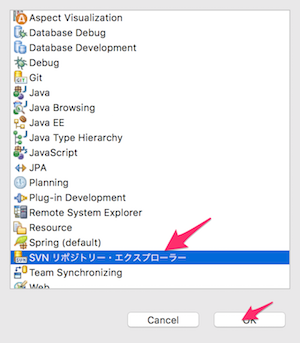

# 3-4. Subversionに接続する
Backlogにある学習用ソースコードをダウンロードしましょう。このソース管理は、Backlogの「Subversion」というサーバアプリケーションで行います。

## ソースコードのダウンロード(チェックアウト）

STSを起動します。

ウィンドウ上部の「Open Perspective」ボタンをクリックします。

「SVN リポジトリー・エクスプローラー」を選択して「OK」をクリックします。

「SVNリポジトリー」ビュー上で右クリックし、「Repository Location」を選択します。

以下のように入力して、「Finish」ボタンをクリックします。

| 項目名 | 設定値 |
| -- | -- |
| URL | https://njoho.backlog.jp/svn/NJP/akikura2/branches/akikura_[メールで連絡されたユーザID]
例えば、通知されたIDがishiyama だった場合は、
https://njoho.backlog.jp/svn/NJP/akikura2/branches/akikura_ishiyama となります。|
| 0:3 | 1:3 |
| 0:4 | 1:4 |

https://njoho.backlog.jp/svn/NJP/akikura2/branches/akikura_ishiyama