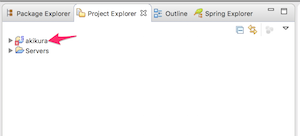

# 3-4. Subversionに接続する
Backlogにある学習用ソースコードをダウンロードしましょう。このソース管理は、Backlogの「Subversion」というサーバアプリケーションで行います。

## ソースコードのダウンロード(チェックアウト）

STSを起動します。

ウィンドウ上部の「Open Perspective」ボタンをクリックします。

「SVN リポジトリー・エクスプローラー」を選択して「OK」をクリックします。

「SVNリポジトリー」ビュー上で右クリックし、「Repository Location」を選択します。

以下のように入力して、「Finish」ボタンをクリックします。

| 項目名 | 設定値 |
| -- | -- |
| URL | https://njoho.backlog.jp/svn/NJP/akikura2/branches/akikura_[メールで連絡されたユーザID]  例えば、通知されたIDがishiyama だった場合は、 https://njoho.backlog.jp/svn/NJP/akikura2/branches/akikura_ishiyama となります。|
| User | **Backlogの**ユーザID |
| Password | **Backlogの**パスワード |
| Save authentidation | チェックを入れる |

接続に成功すると、SVNリポジトリービュー上に設定したURLが表示されます。これは、ソース管理サーバ上のファイルが見えている状態です。

うっかり削除すると、サーバからソースコードが全て消えてしまうので、注意です。

ソースをローカルPCにダウンロードしましょう。
表示された、URLを右クリックし、「検索/別名チェックアウト」を選択します。

初期状態のまま、「Finish」をクリックします。

「Spring」パースペクティブに移動します。画面にボタンが表示されていない場合は、「Open Perspective」ボタンをクリックして、一覧から選択してください。

