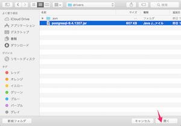
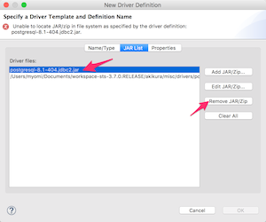
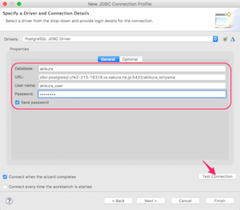

# 3-5. データベースに接続する
インターン学習で使用するデータベースサーバに接続してみましょう。

## 手順
STS を起動します。

「Database Development」パースペクティブに移動します。画面にボタンが表示されていない場合は、「Open Perspective」ボタンをクリックして、一覧から選択してください。

Database Connections を右クリックし、Newを選択します。

以下のように選択・入力して、「Next」をクリックします。

| 項目名 | 設定値 |
| -- | -- |
| データベース | PostgreSQL |
| Name | akikura DBサーバ |

接続設定ダイアログが表示されるので「New Driver Definition」ボタンをクリックします。

「Name/Type」タブでPostgreSQL JDBC Driverを選択します。この時点でダイアログ上部にエラーが表示されますが、この後解決しますので無視してください。

「JAR List」タブで「Add JAR/Zip...」ボタンをクリックします。

ファイル選択ダイアログが開きます。
先ほどダウンロードしたソースコードの中に
misc/drivers/postgresql-9.4.1207.jar
がありますので、それを選択して「開く」をクリックします。

先ほど選んだファイルが一覧に表示されるの確認し、
もともと表示されていた「postgresql-8.1-404.jdbc2.jar」を選択して、「Remove JAR/Zip」をクリックして、行を削除します。

(削除後の状態）

「OK」をクリックすると、元のダイアログに戻ります。
以下のように入力して、「Test Connection」（接続テスト）ボタンをクリックしてください。

| 項目名 | 設定値 |
| -- | -- |
| Database | akikura |
| URL | jdbc:postgresql://tk2-213-16318.vs.sakura.ne.jp:5432/akikura_[メールで通知されたユーザID] （例：あなたがishiyamaならakikura_ishiyama) |
| User Name | akikura_user |
| Password | ダウンロードしたソースのsrc/main/resources/application.yml をテキストエディタで開いてください。そこのpassword欄に記載されている値です。 |
| Save Password | チェックを入れる |

