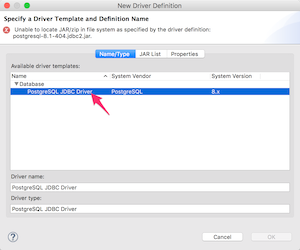

# 3-5. データベースに接続する
インターン学習で使用するデータベースサーバに接続してみましょう。

## 手順
STS を起動します。

「Database Development」パースペクティブに移動します。画面にボタンが表示されていない場合は、「Open Perspective」ボタンをクリックして、一覧から選択してください。

Database Connections を右クリックし、Newを選択します。

以下のように選択・入力して、「Next」をクリックします。

| 項目名 | 設定値 |
| -- | -- |
| データベース | PostgreSQL |
| Name | akikura DBサーバ |

接続設定ダイアログが表示されるので「New Driver Definition」ボタンをクリックします。

