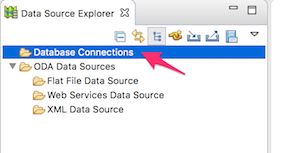

# 3-5. データベースに接続する
インターン学習で使用するデータベースサーバに接続してみましょう。

## 手順
STS を起動します。

「Database Development」パースペクティブに移動します。画面にボタンが表示されていない場合は、「Open Perspective」ボタンをクリックして、一覧から選択してください。

Database Connections を右クリックし、Newを選択します。

aaa

