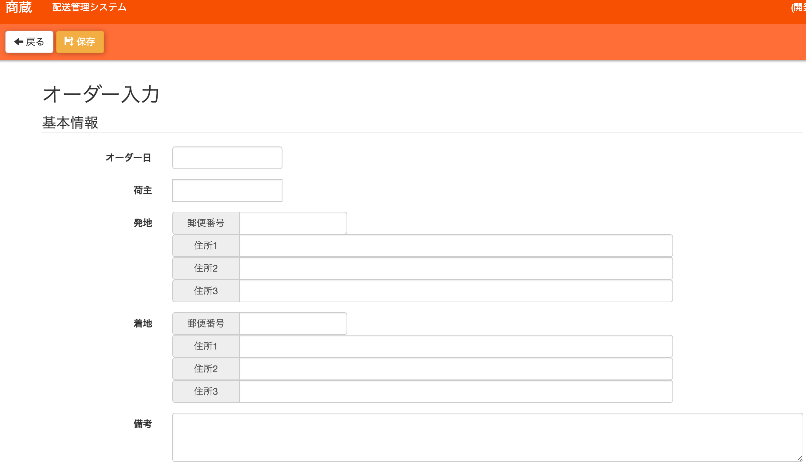
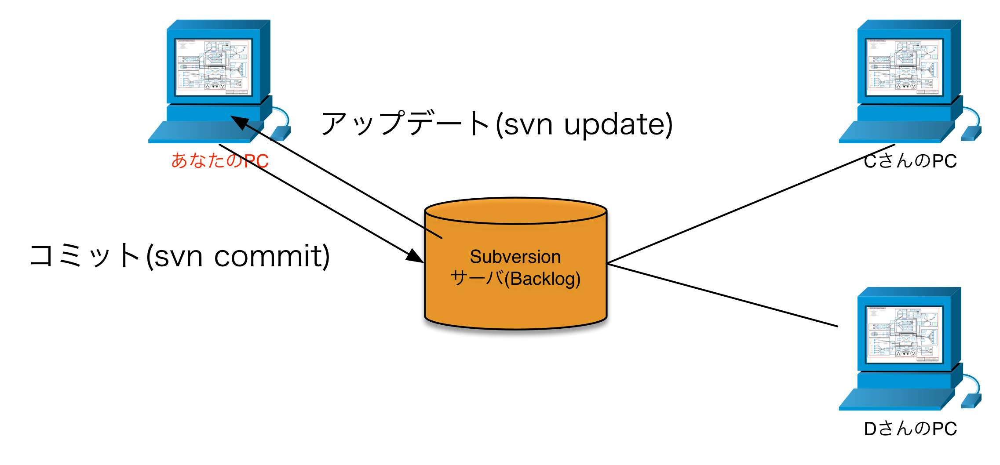
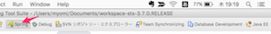
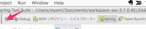
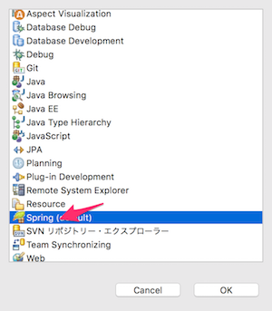
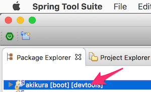
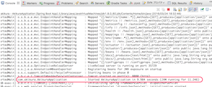

# 3-6. アプリケーション商蔵(akikura)について

これからみなさんには、「商蔵(akikura）」という名前のwebアプリケーションを作ってもらいます。この節では、akikuraについての簡単な説明と、作成中のアプリケーションをPC上で実行する方法について説明します。

## akikuraとは
akikuraは、運送会社が利用する受注・請求・支払データを管理するためのアプリケーションです。

現状は、まだ開発が始まったばかりの状態で、あなたは新しい開発メンバーとして、このプロジェクトに参加したというシチュエーションです（ようこそ！）。

このアプリケーション、幾つかの画面で構成されているのですが、あなたには主に「オーダー登録画面」という画面作成を担当してもらいます。この画面は、荷物を運んで欲しい人（荷主と言います）から運送会社への配送依頼（メール or 電話）を記録するための画面です。

### (オーダー登録画面)

## ソースコードについて
「3-4.Subversionに接続する」で、開発中のakikuraのソースコードを、ローカルPCにダウンロードしました。

これからあなたには、ローカルPC上でダウンロードしたソースコードを改造し、ローカルPC上でアプリケーションの動作確認を行っていただきます。

ここで前提となる知識が幾つかあります。覚えてください。

- 最終的にお客様に納品するソースコードは、Backlogというサービスが提供している **Subversionサーバ（通称SVNサーバ）**で管理します。
  - Subversionサーバには以下の便利機能があります。
    - ソースコードをサーバ上で一元管理することで、複数人が同時に作業できる（各自サーバからソースコードをダウンロードし、完成したらサーバにアップロードする）
    - ソースコードの改訂履歴を管理できます
- この構成のため、ローカルPCで改造したソースコードは、完成したらSubversionにアップロードする必要があります。アップロードのことを**コミット**と言います。
- また、同じソースコードに対して複数の人が作業を行っています。したがって、他の人がソースをコミットしている場合もあります。
- そこであなたは、定期的にSubversionサーバから最新のソースコードを取得する必要があります。これを**アップデート**と言います。
- コミットとアップデートは、すべてのソースコードをアップロード・ダウンロードするわけではなく、変更があったファイルのみを対象にします（差分のみ）

## データベースについて
akikuraは、利用者が入力した業務データを保存するための**データベース**を持っています。あなたが、「3-5. データベースに接続する」で接続したデータベースは、開発用のデータベースをコピーした、あなた専用のデータベースです。

まずはここで、データベースの構成や基本的なSQLについて勉強してもらいます。

## akikuraのコンパイル方法
STS(Eclipse）の自動ビルド機能が有効になっているため、ソースを保存すると自動的にコンパイルが実行されます。

ただ、ソースをダウンロードした直後だと、コンパイルエラーが出ているはずです。以下の手順で解決してください。

### 注意！
以下の作業は、インターネットに接続された状態で行ってください！

### 1.STSを起動します。
起動してね。

### 2.「Spring」パースペクティブを選択
画面右上より、Springパースペクティブを選択します。

もし見当たらなければ、「追加」ボタンを押し、

パースペクティブ選択ダイアログの中からSpringを選択し、「OK」をクリックします。

### 3. 「パッケージエクスプローラ」ビューよりakikuraプロジェクトを選択

画面左側にある「Package Exploler」よりダウンロードしたakikuraプロジェクトを選択します。

Package Exploler が見当たらなければ、メニューの
 Window -> Show View -> Package Explorer を選択して、表示させてください。
 
 
 
### 4. Gradle のリフレッシュ実行
akikuraプロジェクトを選択した状態で 右クリック -> Gradle -> Refresh All を実行します。

akikuraのコンパイル・実行に必要な**ライブラリ**のダウンロードが開始されます。完了までにはしばらく時間がかかります。

この作業が完了すると、コンパイルエラーがなくなっているはずです。

もし「コンパイルエラーがなくなったかどうか、わからない」もしくは「コンパイルエラーが解決しない」場合はここで作業を諦め、インターン初日に状況を説明してください（Slackで質問してくださっても構いません）。

## akikuraの起動方法
ここではakikuraの起動方法と動作確認方法について説明します。以降、本書で「akikuraを起動し〜」のように記載されている場合は、すべてここで説明する作業のことを指します。

実際に手を動かしてakikuraを起動する手順を身につけてください。

### 注意！
以下の作業は、インターネットに接続された状態で行ってください！

### 1.STSを起動
起動したら、Springパースペクティブを選択し、Package Explorer ビューからakikuraプロジェクトを選択してください。

### 2. コンパイルエラーが発生していないことを確認する。
コンパイルエラーがあると、akikuraは起動しません。Problemsビューに記載されているエラー内容を確認し、コンパイルエラーを解決しましょう。

### 3. 実行
akikuraプロジェクトを選択した状態で 右クリック -> Run As -> Spring Boot App を実行します。

実行にはしばらく時間がかかります。Consoleビューに起動処理の状況（ログと言います）が表示されるので、「Started AkikuraApplication in X.XXX seconds...」のように表示されればアプリケーションの起動に成功しています。

 

### 4. 動作確認

- Google Chromeを起動
- http://localhost:8080/tutorial/課題番号.html にアクセス