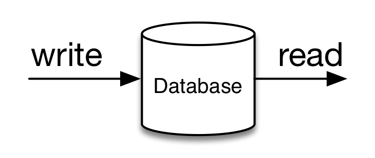
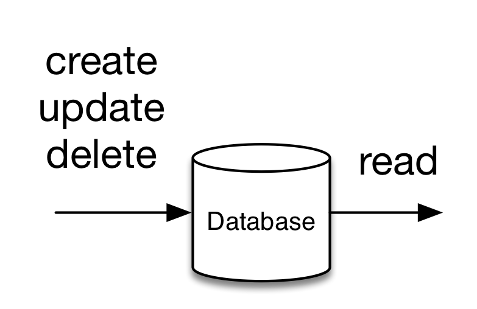

# 4.研修 リレーショナルデータベース基礎
この章ではリレーショナルデータベースについて学びましょう。

## 概要

- リレーショナルデータベースとは：「データベース」というカテゴリのソフトウェアの一種。略してRDB(アールデービー）
- データベースとは、：**データをディスクに登録し、データを検索できるためのソフトウェア**。略してDB（デービー）

(DBはデータを読み書きする箱）

## DBならではの機能
単なるFile I/Oではない。

- write失敗時のリカバリ
- write/read が高速
- 複数人の同時writeの制御
などなど。

## いろいろなRDB製品
いろいろあるよ。製品ごとにコマンドや考え方の差異があるので、全てを知り尽くすのは無理。

| 製品名 | 販売元 | 備考 |
| -- | -- | -- |
| Oracle Database | Oracle | 世界で最も有名なRDB。業務システムで使うRDBは大半がこれ。 |
| SQL Server | Microsoft | サーバがWindows Serverのときは、こっちを使うことが多い |
| DB2 | IBM | マニュアルが読みにくくて困る |
| MySQL | オープンソース | サービス/ゲーム系で大人気のRDB。 |
| PostgreSQL | オープンソース | インターンで使うRDB。 |
| H2 | オープンソース | Javaで書かれたRDB。 |

## write/readするための専用言語
RDBからデータを読み書きするための専用言語が
**SQL(Structured Query Language)**（エスキューエル）。直訳すると、「構造化された（データベースへの）お問い合わせ用言語」。なぜ「構造化された」とつくのかは知らない。構造化されてない言語ってあるのか？

## 3つのwriteと１つのread

| 種類 | 説明 | 使用するSQL文 |
| -- | -- | -- |
| Create | 新しいデータを登録する | INSERT文 |
| Update | すでにあるデータを変更する | UPDATE文 |
| Delete | すでにあるデータを削除する | DELETE文 |
| Read | データを検索する | SELECT文 |

これら４種類の操作を、頭文字をとって**CRUD**(クラッド）という。CRUDという用語はDBに限らず、どこでも出てくる。お客様の要望をCRUDに帰着させるのがシステム開発の基本。

(実はwriteは３つあった！）

## RDBを学ぶとは
学ぶ or 現場でやらせてもらえる順に。。。
1. SQLを学ぶ
2. 高速に動作するSQLが書けるようになる（SQLレベルのパフォーマンスチューニング）
3. RDB製品に付属するプログラム言語（ストアドプロシージャ）
4. データベース設計
5. データベースサーバの見積もりやRDB自体の設定（ハードレベルのパフォーマンスチューニング）

このインターンでは、**1. SQLを学ぶ**のみを扱う

## SQLのお仕事
SQLが書けるとこんなお仕事ができる

- SQLを利用したプログラミング。JavaからSQL実行とか
- お客様からのデータ抽出依頼。例：客「去年の１月度の売上データが欲しいんや！」。お客様の全ての要望を満たす画面機能があることは稀。画面がなければ、SQLで解決や！
- データパッチ。例：PG「プログラムにバグがあり、全ての売上金額が一桁少なく登録されてます!!」-> SQL or die

## 課題
次項より、実際にお客様からお問い合わせがきた体で、問題が記載されています。回答も合わせて記載されていますので、全て**自分の手で書いて**実行してみてください。

### 禁止事項
- 回答をコピペして実行してはいけない。手で書くこと
- 回答を見ずに、考えてSQLを書こうとしてはいけない。回答を写経して、「こんなものなのか」と思ってもらうだけでOK。

