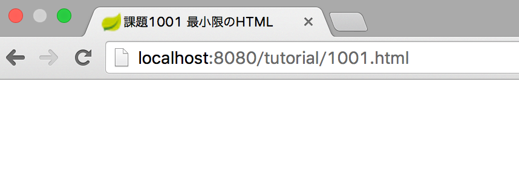

# 5-1. 最小限のHTML

## 1001. 最低限のHTML
### お手本

```html
<!DOCTYPE html>
<html lang="ja">
  <head>
    <meta charset="utf-8">
    <meta name="viewport" content="width=device-width, initial-scale=1">
    <title>課題1001 最小限のHTML</title>
  </head>
  <body>
  </body>
</html>
```

### 画面イメージ



### 解説
- 先頭に <!DOCTYPE html>を書く。この行自体はHTMLじゃない。今からHTML書きますよーという宣言。
- ２行目からがhtml。全体をhtml要素で囲む
- htmlはheadとbodyから成る。
    - headは画面に表示されない情報。ブラウザに画面を表示する際のヒントを与える
    - bodyには画面に表示するテキストを書く
- 今回はぼbodyに何も書いてないので、何も表示されない。虚しい。