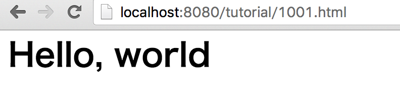
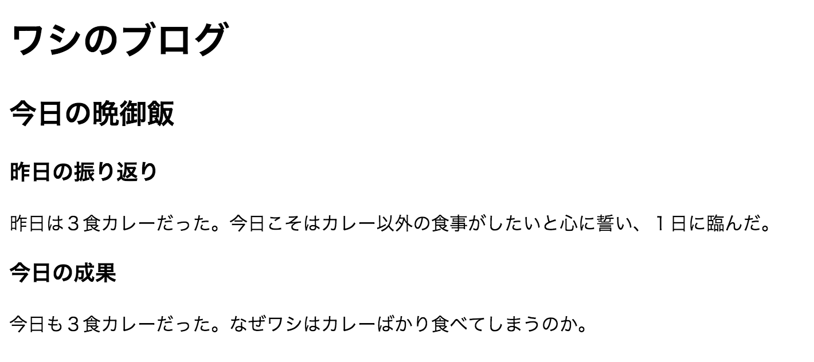

# 5-2. テキスト

## 課題1002. セクションのタイトル
### お手本
***※以降のお手本は、body要素以下のみを記載します。
課題1001に記載されている最低限のHTMLをまず書いて、
body要素をお手本の内容に置き換えてください。***

```html
<body>
  <h1>Hello, World</h1>
</body>
```

### 画面イメージ



### 解説
- body要素の中に画面に表示したいテキストを記述する
- h1 はタイトルを表す要素。h1 - h6まである。

## 課題1003. セクショニング
### お手本
```html
<body>
  <h1>ワシのブログ</h1>
  <article>
    <h2>今日の晩御飯</h2>
    <section>
      <h3>昨日の振り返り</h3>
      <p>
      昨日は３食カレーだった。今日こそはカレー以外の食事がしたいと心に誓い、１日に臨んだ。
      </p>
    </section>
    <section>
      <h3>今日の成果</h3>
      <p>
      今日も３食カレーだった。なぜワシはカレーばかり食べてしまうのか。
      </p>
    </section>
  </article>
</body>
```

### 画面イメージ



### 解説
- 通常、文章には構造があります。書籍なら 本全体->章->節->項など。
- この文章構造のことを**セクション**という。
- セクションを定義する要素は以下の5つ：
    - body, article, section, aside, nav
- 一連の文章をセクションに分けていく作業を**アウトラインを作る**という
- HTMLを作る作業は、「文章をセクション分けしてアウトラインを作る作業」と言える。


