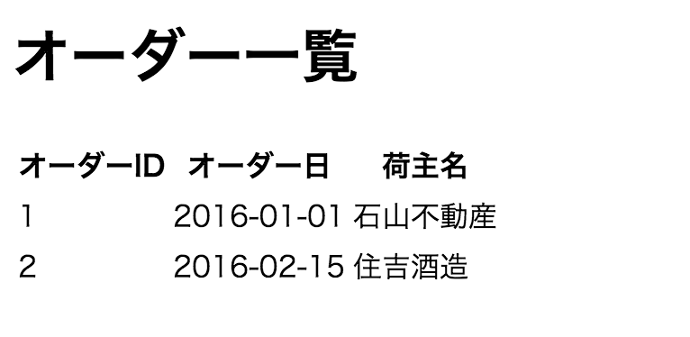
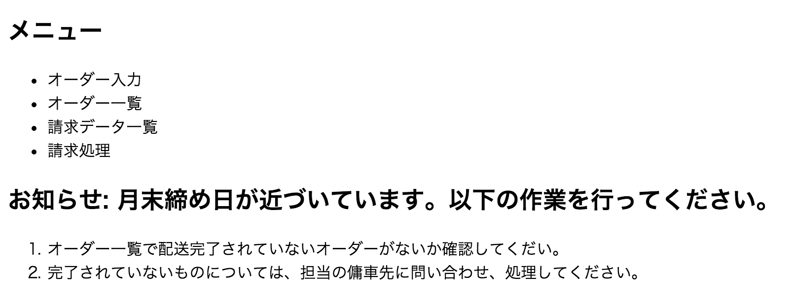

# 5-4. 表・リスト

## 1006 表
### お手本

```html
<body>
  <h1>オーダー一覧</h1>
  <table>
    <thead>
      <tr>
        <th>オーダーID</th>
        <th>オーダー日</th>
        <th>荷主名</th>
      </tr>
    </thead>
    <tbody>
      <tr>
        <td>1</td>
        <td>2016-01-01</td>
        <td>石山不動産</td>
      </tr>
      <tr>
        <td>2</td>
        <td>2016-02-15</td>
        <td>住吉酒造</td>
      </tr>
    </tbody>
  </table>
</body>
```

### 画面イメージ



### 解説
- table タグで表組みが作れる
    - thead がヘッダ部
    - tbody がデータ部
    - tr が行を表す(table rowの略)
    - td がマス目を表す（table dataの略）

## 1007 リスト
### お手本

```html
<body>
  <nav>
    <h1>メニュー</h1>
    <ul>
      <li>オーダー入力</li>
      <li>オーダー一覧</li>
      <li>請求データ一覧</li>
      <li>請求処理</li>
    </ul>
  </nav>
  <article>
    <h1>お知らせ: 月末締め日が近づいています。以下の作業を行ってください。</h1>
    <ol>
      <li>オーダー一覧で配送完了されていないオーダーがないか確認してくだい。</li>
      <li>完了されていないものについては、担当の傭車先に問い合わせ、処理してください。</li>
    </ol>
  </article>
</body>
```

### 画面イメージ



### 解説
- ulで順序なしリスト(unordered list)
- olで順序ありリスト(ordreed list)
