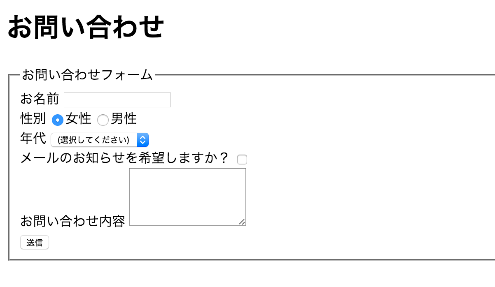

# 5-5. 1005 WEBアプリのための部品

## お手本

```html
<body>
  <h1>お問い合わせ</h1>
  <form>
    <fieldset>
      <legend>お問い合わせフォーム</legend>
      <label for="name">お名前</label>
      <input type="text" name="name" id="name"/>
      <br/>
      
      <label>性別</label>
      <input type="radio" name="gender" id="female" value="1" checked/><label for="female">女性</label>
      <input type="radio" name="gender" id="male" value="2"/><label for="male">男性</label>
      <br/>
      
      <label for="generation">年代</label>
      <select id="generation" name="generation">
        <option value="0" selected>(選択してください)</option>
        <option value="10">10代</option>
        <option value="20">20代</option>
        <option value="30">30代</option>
        <option value="40">40代</option>
        <option value="50">50代</option>
        <option value="60">60代</option>
      </select>
      <br/>
      
      <label for="sendMail">メールのお知らせを希望しますか？</label>
      <input type="checkbox" name="sendMail" id="sendMail"/>
      <br/>
      
      <label for="note">お問い合わせ内容</label>
      <textarea id="note" name="note" rows="5"></textarea>
      <br/>
      
      <input type="submit" name="sendData" id="sendData" value="送信"/>
    </fieldset>
  </form>
</body>
```

## 画面イメージ



## 解説
- input/select/textarea要素で入力用のコントロールを作成できる
- inputはtype属性の値に寄って、コントロールの種類を変更できる
    - text: テキスト入力
    - radio: ラジオボタン
    - checkbox: チェックボックス
    - submit: 送信ボタン
    - button: その他のボタン
    - hidden: 隠しフィールド（画面には表示されない）
- select: プルダウンメニュー
- textarea: 複数行テキスト入力
