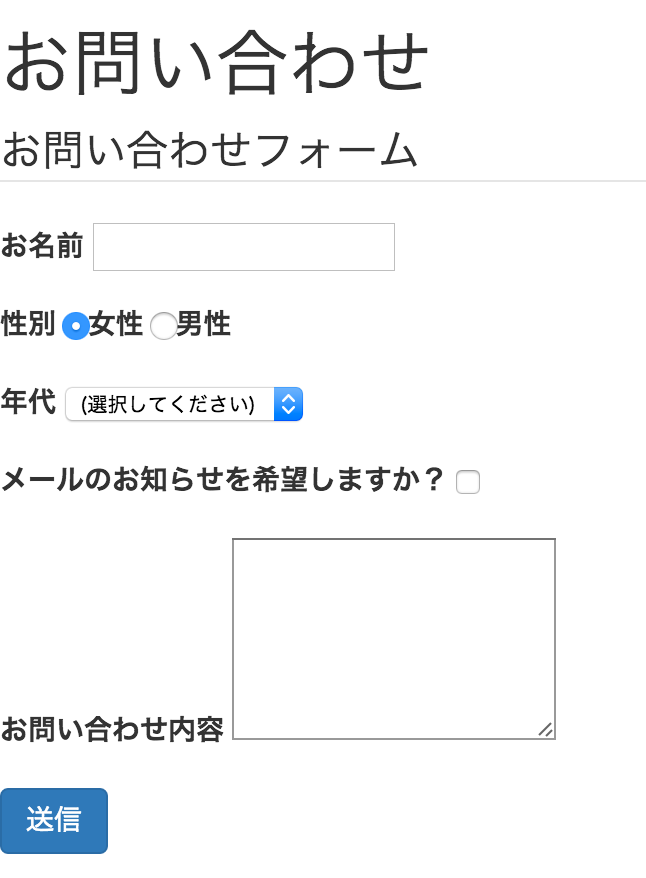

# 5-6. CSS

## 課題1009. 基本
以下の手順に従って作業してください。

課題1001のHTML(1001.html)のheadタグに以下のようにlink要素を追加してください(7行目）

```html
<!DOCTYPE html>
<html lang="ja">
  <head>
    <meta charset="utf-8">
    <meta name="viewport" content="width=device-width, initial-scale=1">
    <title>課題1011 jsの基本</title>
    <link href="/tutorial/1010.css" rel="stylesheet"/>
  </head>
  <body>
    <h1>Hello, World</h1>
  </body>
</html>
```

次に、src/main/resources/static/tutorial フォルダに1006.cssというファイル名で新規ファイルを作成し、以下のように記述してください。

```css
h1 {
  color: red;
}
```

### 画面イメージ


### 解説
- CSS（Cascading Style Sheets)は、ブラウザがHTMLを表示する際の見た目をカスタマイズする言語
- CSSは以下の構造で記述する

```css
[どの場所をカスタマイズするか] {
  [カスタマイズ項目名]: [値];
}
```
- カスタマイズ場所の指定を**セレクタ**という
- カスタマイズ項目名を**プロパティ**という
- 上記の例は「h1要素の色を赤色にする」という設定

## 課題1010. CSSフレームワーク
以下の手順に従って作業してください。

課題1008のHTML(1008.html)のheadタグに以下のようにlink要素を追加してください(7行目）

```html
<!DOCTYPE html>
<html lang="ja">
  <head>
    <meta charset="utf-8">
    <meta name="viewport" content="width=device-width, initial-scale=1">
    <title>課題1008 CSS</title>
    <link href="/lib/bootstrap-customized/css/bootstrap.min.css" rel="stylesheet"/>
  </head>
  <body>
    <!-- body部は省略 -->
  </body>
</html>
```

さらにbody部の内容を以下のように修正します。
- labelとコントロールの組み合わせをdiv要素で囲む
- submitボタンにclass属性をつける

```html
<body>
  <h1>お問い合わせ</h1>
  <form>
    <fieldset>
      <legend>お問い合わせフォーム</legend>
      <div class="form-group">
        <label for="name">お名前</label>
        <input type="text" name="name" id="name"/>
      </div>
      
      <div class="form-group">
        <label>性別</label>
        <input type="radio" name="gender" id="female" value="1" checked/><label for="female">女性</label>
        <input type="radio" name="gender" id="male" value="2"/><label for="male">男性</label>
      </div>
      
      <div class="form-group">
        <label for="generation">年代</label>
        <select id="generation" name="generation">
          <option value="0" selected>(選択してください)</option>
          <option value="10">10代</option>
          <option value="20">20代</option>
          <option value="30">30代</option>
          <option value="40">40代</option>
          <option value="50">50代</option>
          <option value="60">60代</option>
        </select>
      </div>
      
      <div class="form-group">
        <label for="sendMail">メールのお知らせを希望しますか？</label>
        <input type="checkbox" name="sendMail" id="sendMail"/>
      </div>
    
      <div class="form-group">
        <label for="note">お問い合わせ内容</label>
        <textarea id="note" name="note" rows="5"></textarea>
      </div>  
      
      <div class="form-group">
        <input type="submit" name="sendData" id="sendData" class="btn btn-primary" value="送信"/>
      </div>  
    </fieldset>
  </form>
</body>
```

### 画面イメージ



### 解説
- 課題1008の時に比べて、入力フォームが多少見やすくなっている
- CSSの作成は基本的にWEBデザイナの仕事。システムエンジニアがCSSの仕様とデザインテクニックを理解してお客様の期待に応える綺麗な画面を作るのは難しい。
- CSSやWEBデザインに詳しくなくてもある程度簡単にWEB画面を作れる、CSS部品集がオープンソースでいくつか提供されている。これを**CSSフレームワーク**という。
- インターンでは、[Bootstrap](http://getbootstrap.com/)というCSSフレームワークを利用する。