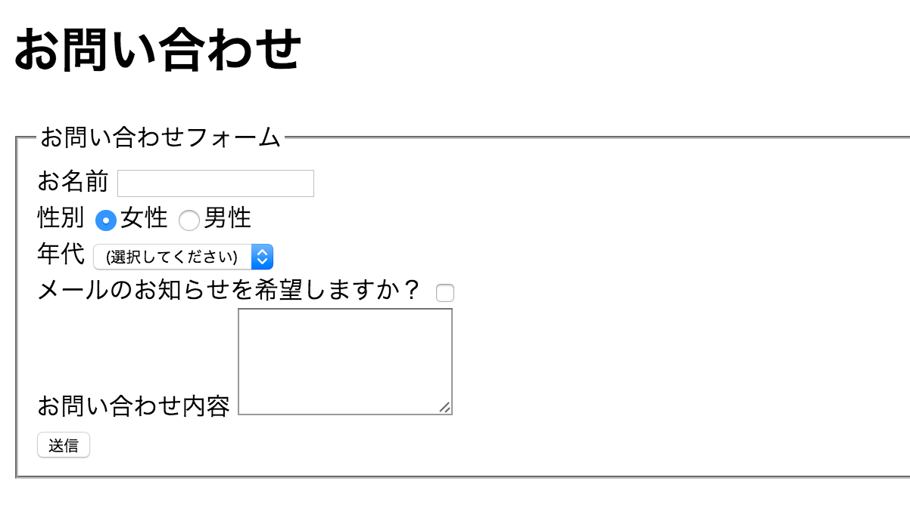

# 5-6. CSS

## 課題1009. 基本
以下の手順に従って作業してください。

課題1002のHTML(1002.html)のheadタグに以下のようにlink要素を追加してください(7行目）

```html
<!DOCTYPE html>
<html lang="ja">
  <head>
    <meta charset="utf-8">
    <meta name="viewport" content="width=device-width, initial-scale=1">
    <title>課題1002 テキスト</title>
    <link href="/tutorial/1006.css" rel="stylesheet"/>
  </head>
  <body>
    <h1>Hello, World</h1>
  </body>
</html>
```

次に、src/main/resources/static/tutorial フォルダに1006.cssというファイル名で新規ファイルを作成し、以下のように記述してください。

```css
h1 {
  color: red;
}
```

### 画面イメージ

