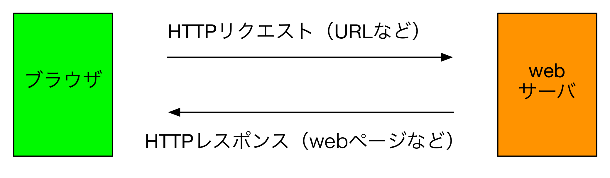

# 6-1. Webサイトのしくみ
## Webサイトがブラウザに表示されるまでの仕組み
### ユースケース
1. 利用者はブラウザを起動します。
2. 利用者はブラウザのアドレスバー欄に**URL**（例：http://www.nakamura-joho.co.jp）と入力し、Enterキーを押下します。
3. しばらくするとブラウザ上に要求したWebページ内容が表示されます。

### 内部動作

- (1) ブラウザからWebサーバに対して情報を要求します。この要求時にサーバに送信する情報を**HTTPリクエスト**と言います。
- (2) Webサーバは要求されたファイルをブラウザに返却します。この返却情報を**HTTPレスポンス**と言います。

### HTTPって何？
Hyper Text Transfer Protocol の略。「Hyper Text」はHTMLの時に説明した、ハイパーなテキストのこと（何がハイパーか覚えてますか？）。

略すと「ハイパーテキストを運ぶ規約」。

### プロトコルって何？
直訳すると規約。システム屋業界では「通信の決まりごと」つまり通信仕様。

プログラマは、仕様に従ったリクエストと送るようにブラウザをプログラムし、仕様に従ったレスポンスを返すよう、サーバのプログラムを書く。

#### 脱線
封筒に郵便番号・住所・宛先を書けば郵便物を送ることができる。これが、日本の郵便事業のプロトコル。

たまに、宅配者が郵便物を届けずに自宅に持ち帰ったりする。これは郵便事業プロトコルのバグ。

### 基本終わり
HTTPリクエストとレスポンスについて、もう少し詳しく説明する必要があるが、一旦ここまで。