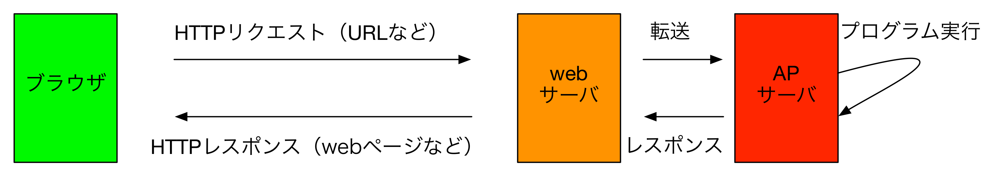

# 6-2. Webアプリのしくみ

## Webアプリがブラウザに表示されるまでの仕組み
### ユースケース
1. 利用者はブラウザを起動します。
2. 利用者はブラウザのアドレスバー欄にwebアプリの**URL**と入力し、Enterキーを押下します。
3. しばらくするとブラウザ上に要求したWebアプリ内容が表示されます。

...webサイトと変わんないじゃないか！

### 内部動作

- (1) ブラウザからWebサーバに対して情報を要求します。webサイトと一緒！
- (2) Webサーバは要求されたリクエストをAPサーバに転送します。
- (3) APサーバは要求されたリクエストを元にプログラムを実行し、「動的に」webサイトを生成します。
- (4) APサーバで動的に生成されたwebサイトはwebサーバに送られ、そのままHTTPレスポンスとして、ブラウザに返されます。

### 動的と静的
プログラムによって、「利用者のリクエストの都度、リアルタイムに生成される」webサイトを動的サイト(dynamic site)と言います。webアプリではこの技法を活用します。

一方、通常のHTMLや画像ファイルなど、いつリクエストしても内容が変わらないファイルを静的サイト(static site)と言います。
かつてのホームページやwebデザイナさんが作成するサイト・企業ページは静的サイトが多かったですが、最近はWordPressなどの**CMS**を使うことが多いらしいので、今あるwebサイトのうち大半が動的サイトかもしれませんね。

### サーバって何？
server（サーバ）は、日常用語のサーバ（給仕さん）や
