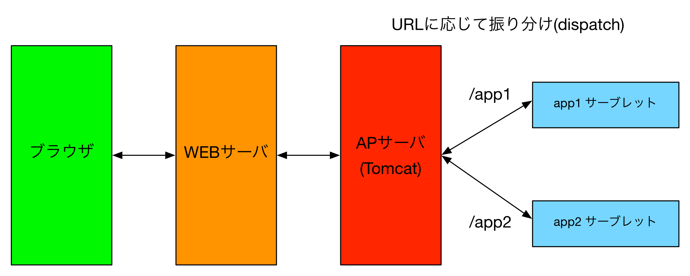

# 6-4. サーブレット

JavaでWebアプリケーションを作る際の概要を説明します。

## 概要
- JavaのWebアプリケーションは、JavaEE(Java Enterprise Edition）の仕様に従って作成します。
    - 最新の仕様はJavaEE7
    - 仕様：
- JavaのWebアプリで、利用者からのリクエストを受け付ける窓口（エントリポイント）は**サーブレット**というクラスです。
    - エントリポイントは、HttpServletクラスを継承してクラスを作成します。このため、俗にサーブレットと呼ばれます。
    - 通常のコマンドラインアプリではエントリポイントとしてmainメソッドを作成する必要がありますが、サーブレットのエントリポイントとなるメソッドは大きく３つあります（他にもあるが使わないので省略）。
        - doGet -> GETメソッドのリクエストが来た時の処理を書く
        - doPost -> POSTメソッドのリクエストが来た時の処理を書く
        - service -> HTTPメソッドの種類を問わずなんでも受け付ける、武器なんか捨ててかかってこいよ、なメソッド。

