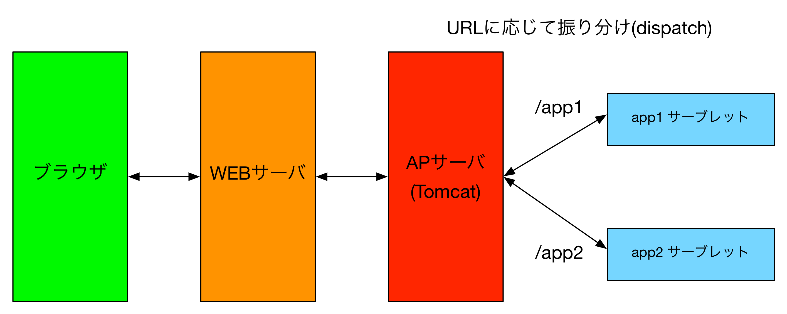
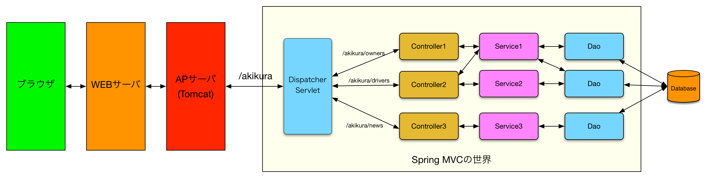

# 8-2. Spring MVC概説

ここでは、Spring Frameworkに含まれている、「Spring MVC」と言う機能について簡単に解説します。

まずは、[6-4. サーブレット](../chapter06/0605servlet.md)で出てきた、サーブレットを使ったWebアプリの構成図をもう一度見てください。



サーブレットの特徴をおさらいすると、以下の通りです。

- 特定のURLパスに対するHTTPリクエストが、対応するサーブレットに送られる(例： /app1 -> App1Servlet）
- サーブレット内の処理は、リクエストされたHTTPメソッドの種類に応じて、service, doPost, doGetなどに振り分けられる
- 専用のOutputStreamにHTML文字列を出力することにより、HTTPレスポンスを生成できる。

さて、この特徴を踏まえて、サーブレットのみでWebアプリケーションを作成することに対してリスクがないか、考えてみてください。果たしてサーブレットのみで、大規模なWebアプリケーションを高速かつ堅牢に作ることはできるでしょうか？

## サーブレット飲みでWebアプリケーションを作ることのリスク

### サブパスへの対応
１つのWebアプリケーションで利用可能なURLのパスは１つではないはずです。例えば、akikuraアプリのベースパスが/akikuraで、以下のような設計をしたと仮定します。

| HTTPメソッド | URLパス | 動作仕様 |
| -- | -- | -- |
| GET | /akikura/orders | オーダー一覧画面を表示する |
| GET | /akikura/orders/{id} | 指定されたIDのオーダー詳細画面を表示する |
| GET | /akikura/orders/entry | オーダー登録画面を表示する |
| POST | /akikura/orders | オーダー登録を実行する |

皆さんはどう実装しますか？

- あなたはまず、/akikura に対応するサーブレット、AkikuraServletを作ります。
- AkikuraServletのdoPost, doGetメソッドの中で、リクエストされたパスをチェックし、処理を振り分けます。こんな感じで。。。

```java
protected void doGet(HttpServletRequest request, HttpServletResponse response) 
  throws ServletException, IOException {
  
	String path = request.getRequestURI();
	if ("/akikura/orders".equals(path)) {
        // オーダー一覧
	} else if ("/akikura/orders/entry".equals(path)) {
		// オーダー登録
	} // ...地獄！
}
```

。。。これは嫌な予感がします。大規模なWebアプリケーションになると、大量のURLパスに対応する必要があるため、あっという間にコードが肥大化しそうです。

また、一つのメソッドの中に複数の画面処理が混在するため、ある特定の画面の修正を行ったつもりが、別の画面機能を意図せずに壊してしまった、、！というリスクもあります。

- **(リスク１）サーブレットメソッドの肥大化**
- **(リスク２）機能改修時のリグレッション（デグレード）**

### HTMLの出力
先ほどのif文の中に、HTMLを生成する処理を書くことを考えると、さらにコードが肥大化しそうです。

```java
protected void doGet(HttpServletRequest request, HttpServletResponse response) 
  throws ServletException, IOException {
  
	String path = request.getRequestURI();
	if ("/akikura/orders".equals(path)) {
        // オーダー一覧
        PrintWriter out = response.getWriter();
		out.println("<html>");
        // 以下、延々と続く。。。
	} else if ("/akikura/orders/entry".equals(path)) {
		// オーダー登録
        // ここは別のHTML生成処理
	} // ...地獄！
}
```

また、これまで学んできたように、JavaとHTMLは全く違う言語です。Javaのコンテキストの中で、HTMLコードを**Java文字列で記述する**など、入力ミスする予感しかしません。Java文字列内の記述は、IDEのコードアシストが効きませんからね。。。

- **（リスク３）ある言語のコンテキスト内に、別の言語が埋め込まれる**

### DBアクセス処理 
さらに、サーブレットの中にDBアクセスの処理を追加して、、、となると、これはサーブレットメソッドが一体何行になるのか、見当もつきません。

適切なモジュール分割が必要です。

- **（リスク４）適切な粒度で、プロジェクトメンバ全員が共有出来るモジュール分割のルールがない**

### 全てが文字列
[7.研修 サーブレット](../chapter07/README.md)で作成したプログラムで、フォームに入力された値を取り出す処理をもう一度見てみましょう。

```java
String name = request.getParameter("name");
String sex = request.getParameter("sex");
```

このように、HttpServletRequest#getParameter(key) で入力値を取り出すわけですが、取り出した値は全て文字列です。できれば適切な型を使ってプログラミングしたいですよね。数値なら、Integer, Long, BigDecimal、日付ならLocalDateなど。。

そこで、以下のようなプログラミングになるわけです。

```java
// 年齢
String strAge = request.getParameter("age");
try {
	int age = Integer.parseInt(strAge);
} catch (NumberFormatException e) {
	// 数値以外が入力された時。。。
}
```

これは画面項目が増えるに従い、コード量が爆発的に増加しそうです。

- **（リスク５）画面項目の入出力が全て文字列でのやり取りとなる。そのため、業務処理（ビジネスロジック）実行のために明示的にキャストする必要がある**

## Spring MVC導入のメリット
以上のリスクを改善する手段として、Webアプリケーションフレームワークを導入します。タイトルには、「Spring MVC導入のメリット」と書きましたが、これはSpring MVCに限らず、他のWebフレームワークを導入する意図同じです。それぞれ細かな記法や設計方針の違いがありますが、どれも前述のリスクを改善するための手段として提供されるものと認識しましょう。

それでは、Spring MVCの導入により前述のリスクがどのように改善されるのかを見ていきましょう。


### Spring MVCのモジュール構成
まず、Spring Frameworkのリファレンス[21.2 The DispatcherServlet](http://docs.spring.io/spring/docs/current/spring-framework-reference/htmlsingle/#mvc-servlet)の図21.1を引用します。これが、Spring Frameworkの構成だっ！！


...これだけだと、なんのこっちゃだと思うので、今まで説明で使ってきた~~しょぼい~~構成図にSpring MVCの登場人物を追記してみます。図が小さかったら、拡大してみてね。



この図をもとに一つづつ機能を解説します。先ほど挙げたリスクが、どのように解決されているかを注目しながら聞いてください。